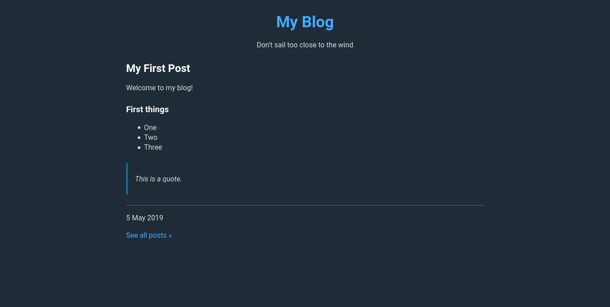

# Blognow  [](https://goreportcard.com/report/github.com/johnjago/blognow)

Blognow is a static site generator for blogs.

There is no configuration, confusing theme files, or complex hierarchies of
pages and posts. It uses an opinionated, straightforward design courtesy of
[Water.css](https://github.com/kognise/water.css).

## Build

To build the binary, run

```sh
go build .
```

You should then have the binary `blognow` in the same directory as the project.
The path to the binary can then be added to the PATH for easy usage no matter
where you are.

## Usage

`blognow my-blog` creates a new blog in the directory my-blog.

You'll see a few directories inside:

- **posts** is where you write posts as .md files
- **templates** are the HTML templates (you shouldn't need to modify anything here)
- **config.toml** is a configuration file, ready to go. It really is no configuration,
  but you may want to change the name of the blog.

### config.toml

A default config file is automatically created when you make a new blog.

```
baseURL = "https://example.org/"
title = "My Blog"
tagline = "Don't sail too close to the wind"
dateFormat = "2 January 2006"
```

There is no configuration apart from the four lines you see here.

### Generating the blog

`blognow` generates a static site in dist/. You can copy these files to any
place where you can host static websites. It looks in the posts/ directory
and formats any correctly structured .md file as HTML.

It creates an index page (the latest post), individual post pages, and an
archive page.

### Post format

```
---
title = "Post Title"
date = 2019-06-28
---

# Heading 1
## Heading 2
### Heading 3

This is a paragraph.

- This
- is
- a
- list.
```

Refer to a [Markdown reference](https://github.com/adam-p/markdown-here/wiki/Markdown-Cheatsheet)
for a complete list of formatting options.

## Running your blog locally

```
$ npm i http-server -g
$ http-server dist/
```

## Screenshots


### Dark theme

If the computer is set to use a dark theme, a dark theme will automatically
be applied.



## Contribute

Blognow is currently under development. If you would like to report an issue or
suggest a feature, please do so!

Pull requests are welcome!

## License

MIT
