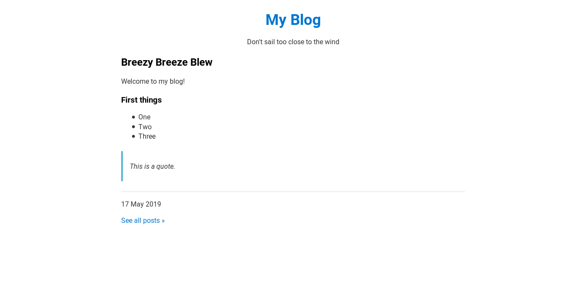
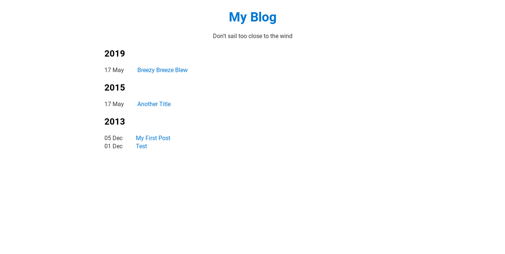

# Blognow  [](https://goreportcard.com/report/github.com/johnjago/blognow)

Blognow is a static site generator for blogs. There is no configuration,
confusing theme files, or complex hierarchies of pages and posts. It uses an
opinionated design that is optimized for reading, with particular attention
to typography.

The screenshots below do not reflect the final design. As of now, it's more
of a placeholder.

Blognow is in **alpha** and should not be used in production. It's changing a
lot right now as I work to design a great workflow for writing and publishing
to a static site.

## Proposed usage

`blognow my-blog` creates a new blog in the directory my-blog.

`blognow` generates a static site in dist/. You can copy these files to any
place where you can host static websites. It looks in the posts/ directory
and formats any correctly structured .md file as HTML.

It creates an index page (the latest post), individual post pages, and an
archive page.

The format for a post is:

```
---
title = "Post Title"
date = 2019-06-28
---

# Heading 1
## Heading 2
### Heading 3

This is a paragraph.

- This
- is
- a
- list.
```

Refer to a [Markdown reference](https://github.com/adam-p/markdown-here/wiki/Markdown-Cheatsheet)
for a complete list of formatting options.

## Running your blog locally

```
$ npm i http-server -g
$ http-server dist/
```

## Screenshots





## Contribute

Blognow is currently under development and is not stable. If you would like to
report an issue or suggest a feature, check out the GitHub issues.

Pull requests are welcome!

## License

MIT
